# AWS VPC Peering Architecture

## Overview  

In this project, I built a private networking architecture on AWS by creating multiple Virtual Private Clouds (VPCs) and connecting them using VPC Peering.

The goal was to simulate real-world cloud network segmentation and enable private communication between isolated environments without using the public internet.

This project demonstrates core cloud networking concepts including:
- Cloud network design using Amazon VPC  
- Private inter-VPC connectivity with VPC Peering  
- Routing configuration with route tables  
- Security enforcement using security groups and network ACLs  
- Real-world troubleshooting of cloud networking issues  

---

## High-Level Architecture  

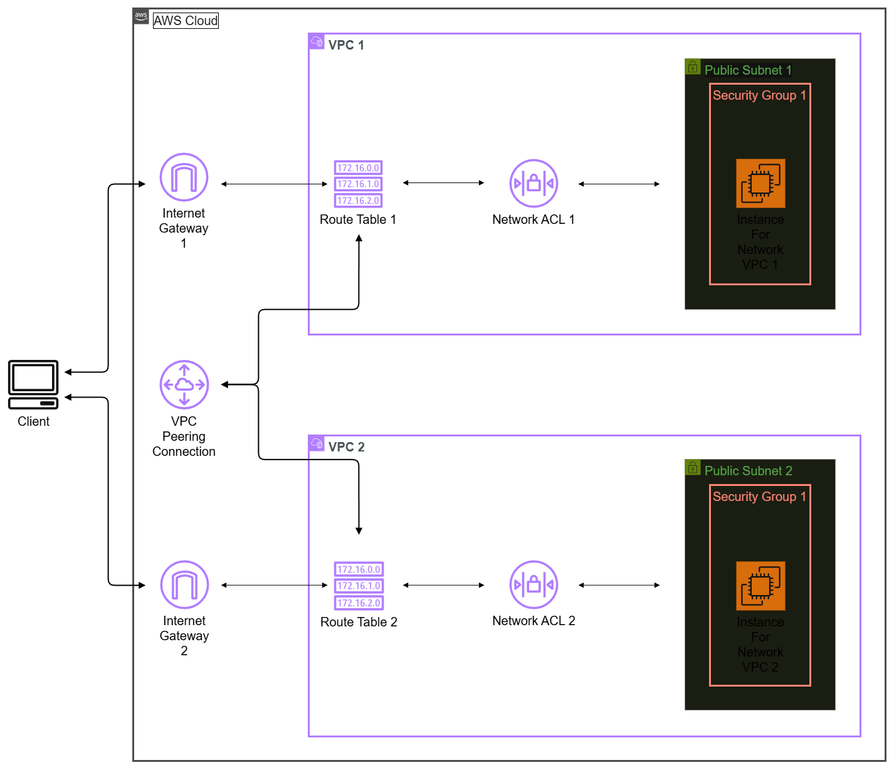

Each VPC contains:
- One public subnet  
- One public route table associated with the subnet for outbound traffic routing
- An internet gateway attached to the VPC
- A default security group controlling instance traffic  
- A default network ACL controlling subnet traffic
- One EC2 instance for connectivity testing

--- 
  
### VPC Networking Components  
  
- VPC Peering Connection  
- Public Subnets  
- Route Tables  
- Internet Gateway  
- Security Groups  
- Network ACLs
---

## Project Walkthrough  

### 1. VPC Creation  

Two isolated VPCs were created with unique, non-overlapping CIDR blocks to enable private routing between networks.  
  
Each VPC was configured with:  
- A single Availability Zone  
- One public subnet  
- No private subnets  
- No NAT Gateway  
- No VPC endpoints  
  
This simplified architecture keeps the focus on VPC peering, routing, and security fundamentals.  
  
- **VPC 1:** `10.1.0.0/16`  
  
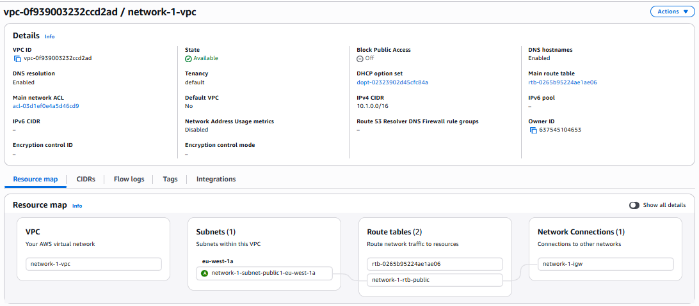  
  
- **VPC 2:** `10.2.0.0/16`  
  
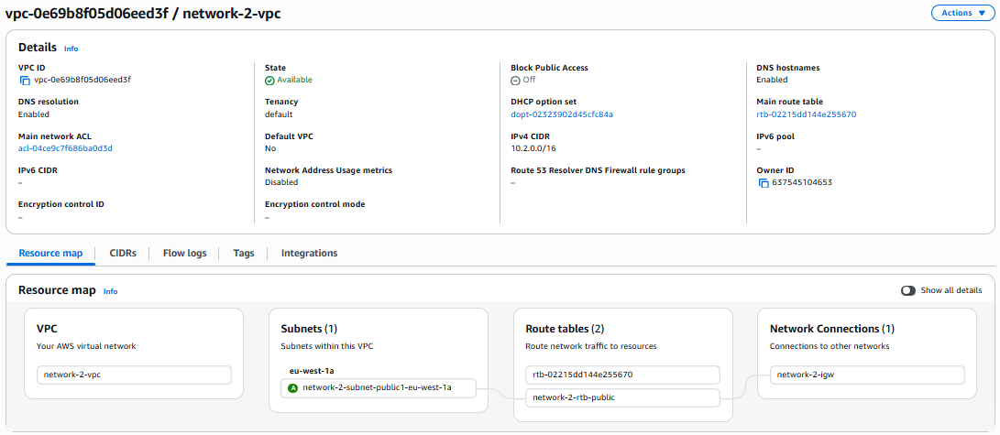

---

### 2. VPC Peering Setup  

To enable private communication between both VPCs, a VPC peering connection was created. 

The peering process involves one VPC acting as the requester and the other as the accepter. Traffic can only flow once the request is accepted and routing is configured. 

VPC 1 was selected as the requester and VPC 2 as the accepter.  
Both VPCs use non-overlapping CIDR ranges to allow proper routing.  

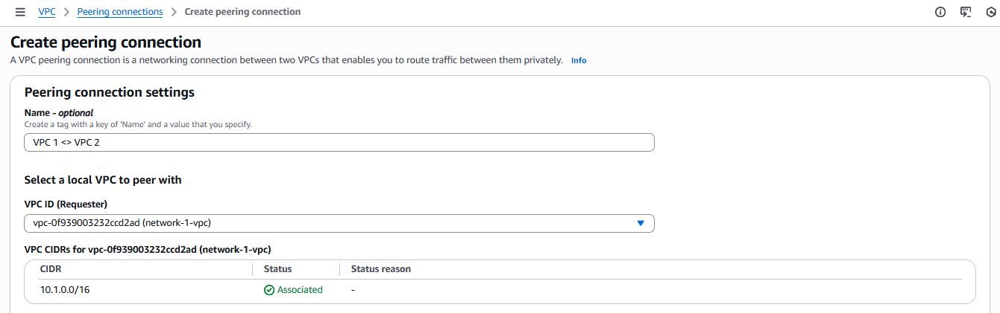  

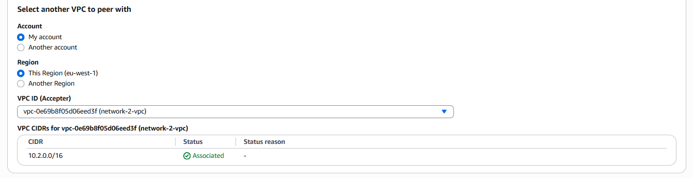  
  
Once created, the peering connection enters a pending state until the accepter approves it.  This means that the connection exists, but traffic cannot flow until approval.  
  
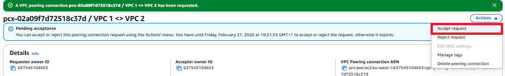
  
The peering request was accepted from the accepter VPC.  
  
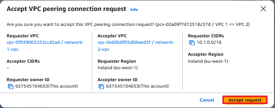

After acceptance, the peering connection becomes active and ready for routing configuration.  
  
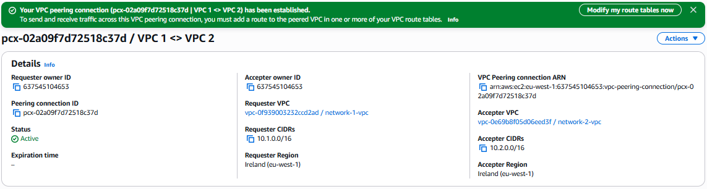  
  
At this point, the two VPCs are privately linked.   

---

### 3. Route Table Configuration  

The route tables for each VPC were updated with new routes to enable traffic flow through the VPC peering connection.  
  
Even though the peering connection was active, traffic would not flow between the networks until explicit routes were defined in each VPC’s route table.

**VPC 1 Route:**
- Destination: `10.2.0.0/16`  
- Target: VPC Peering  

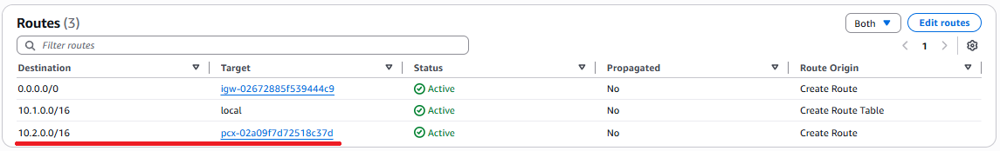  

**VPC 2 Route:**
- Destination: `10.1.0.0/16`  
- Target: VPC Peering  

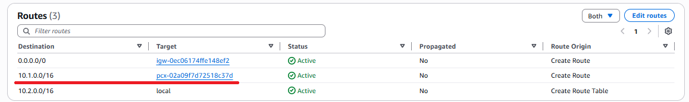

---

### 4. EC2 Instance Deployment  

One EC2 instance was launched in each VPC to act as test endpoints for validating private network connectivity across the peering connection.  
  
Each instance was deployed into its respective public subnet **without being assigned a public IP address** and using the default security group for the VPC with the following configuration:  
  
- **AMI:** Amazon Linux 2023  
- **Instance Type:** t3.micro  
  
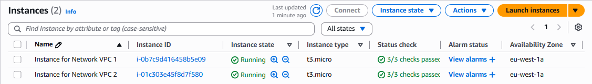

---

### 5. Public Access Configuration  


The EC2 instance in VPC 1 was initially launched without a public IP address.  
To enable SSH access using EC2 Instance Connect, an Elastic IP was allocated and associated with the instance.  
  
EC2 Instance Connect requires a public IPv4 address for inbound connectivity when accessing instances over the internet.  
  
An Elastic IP provides a static public IPv4 address that remains consistent across instance restarts, unlike the default dynamic public IP assigned by AWS.  
  
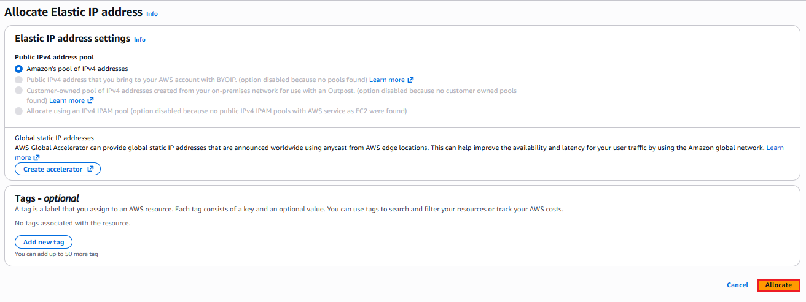  
  
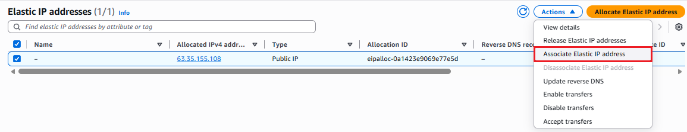  
  
Once associated, the EC2 instance received a public IPv4 address, allowing secure access via EC2 Instance Connect.  
  
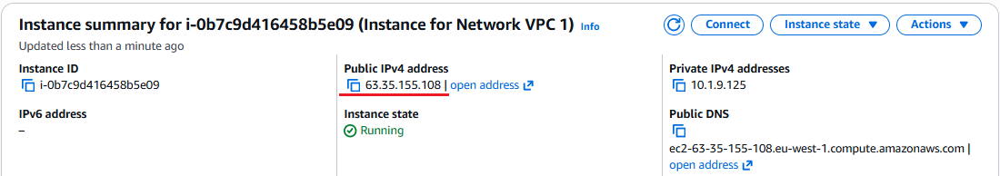

---

### 6. Security & Connectivity Troubleshooting  


During connectivity testing, several issues were identified and resolved.  
  
**Issues encountered:**  
- SSH access to the VPC 1 instance was blocked by its default security group  
- ICMP traffic between VPC 1 and VPC 2 was blocked by VPC 2’s default security group  
  
**Resolutions implemented:**  
  
- An inbound SSH rule (TCP port 22) was added to the default security group in **VPC 1** to allow remote access  

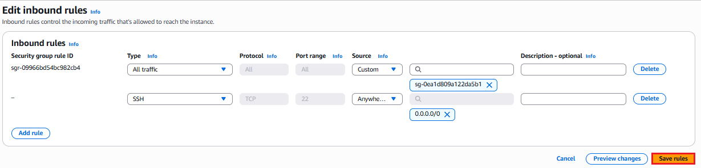  

- An inbound ICMP rule was added to the default security group in **VPC 2**, allowing inbound traffic from the **VPC 1 CIDR range (10.1.0.0/16)**
  
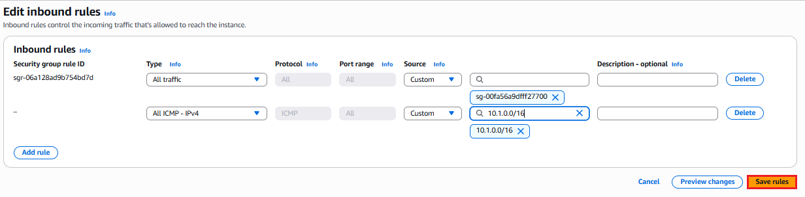

---

### 7. Connectivity Validation  

Once routing and security rules were correctly configured, private connectivity between the two VPCs was validated from the EC2 instance in VPC 1.  
  
The private IP address of the EC2 instance in VPC 2 was tested using ICMP:

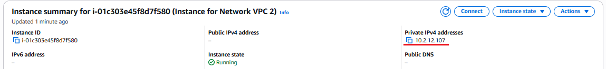  

```bash
ping 10.2.12.107
```
Successful responses confirmed that traffic was flowing through the VPC peering connection using private IP addressing.

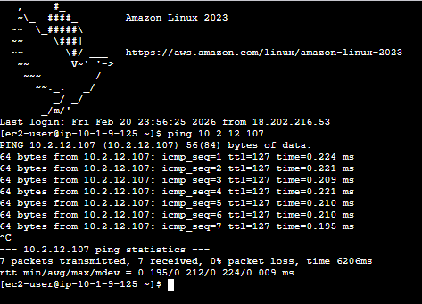  

---

## Key Design Decisions  
  
- Used non-overlapping CIDR blocks to support private routing for VPCs
- Exposed only one EC2 instance publicly as a test host
- Kept the second instance private for security best practices
- Avoided NAT gateways and private subnets to focus on peering fundamentals

---

## Conclusion   
  
This project demonstrates how isolated AWS VPCs can be securely connected using VPC peering with proper routing and security controls.  
  
Through hands-on configuration and troubleshooting, private network communication was successfully implemented and validated.  
  
The skills and patterns used in this project directly reflect real-world AWS networking practices.

---
