# AWS VPC Peering Architecture

## Overview  

In this project, I built a private networking architecture on AWS by creating two Virtual Private Clouds (VPCs) and connecting them using VPC Peering.

The goal was to simulate real-world cloud network segmentation and enable private communication between resources in separate VPCs without routing inter-VPC traffic through the public internet.

This project demonstrates core cloud networking concepts including:
- Cloud network design using Amazon VPC  
- Private inter-VPC connectivity with VPC Peering  
- Routing configuration with route tables  
- Security enforcement using security groups and network access control lists (NACLs)

---

## High-Level Architecture  

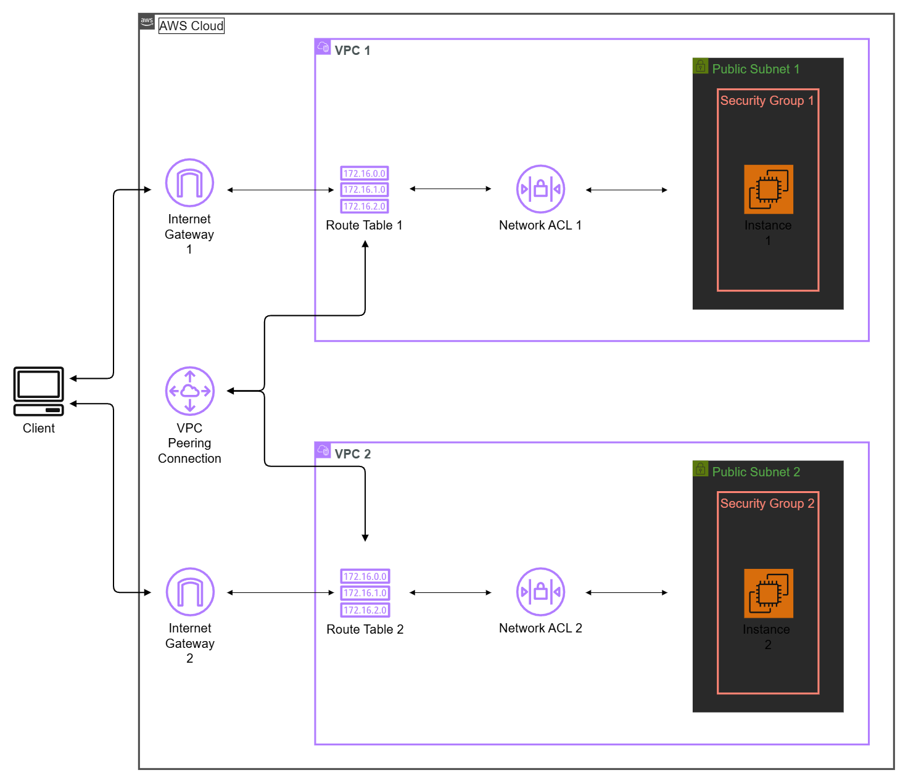

Each VPC contains:
- One public subnet  
- An Internet Gateway attached to the VPC
- One route table containing routes for local VPC traffic, internet-bound traffic, and traffic destined for the peered VPC
- A NACL controlling subnet traffic
- One EC2 instance for connectivity testing
- A security group controlling instance traffic  

---

## Key Networking Concepts

- **VPC Peering:** Provides private connectivity between two VPCs.
- **Route Tables:** Direct traffic destined for the peer VPC through the peering connection.
- **Security Groups:** Control traffic at the EC2 instance level.
- **NACLs:** Provide stateless traffic filtering at the subnet level.
- **Private IPv4 Addresses:** Used for communication between the EC2 instances across the peering connection.

---

## Project Walkthrough  

### 1. VPC Creation  

Two separate VPCs were created with non-overlapping CIDR blocks. Each VPC was configured with a public subnet, a NACL, a route table and an Internet Gateway. 

Each public subnet belongs to its respective VPC and is associated with that VPC's route table. The route table contains a local route for the VPC CIDR, which provides routing for traffic within the VPC, and a default route (`0.0.0.0/0`) pointing to the Internet Gateway, allowing resources in the public subnet to communicate with the internet. 

Each VPC also has a NACL, which provides a stateless layer of network traffic filtering at the subnet level. The default NACL allows inbound and outbound traffic unless its rules are modified.

The VPCs use non-overlapping CIDR ranges to prevent routing conflicts and ensure that traffic can be routed unambiguously between the VPCs once the peering connection is established.
  
- **VPC 1:** `10.1.0.0/16`  
  
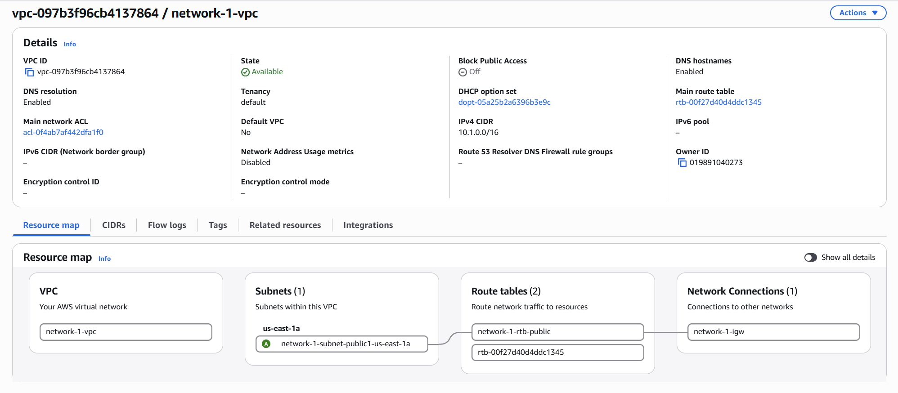  
  
- **VPC 2:** `10.2.0.0/16`  
  
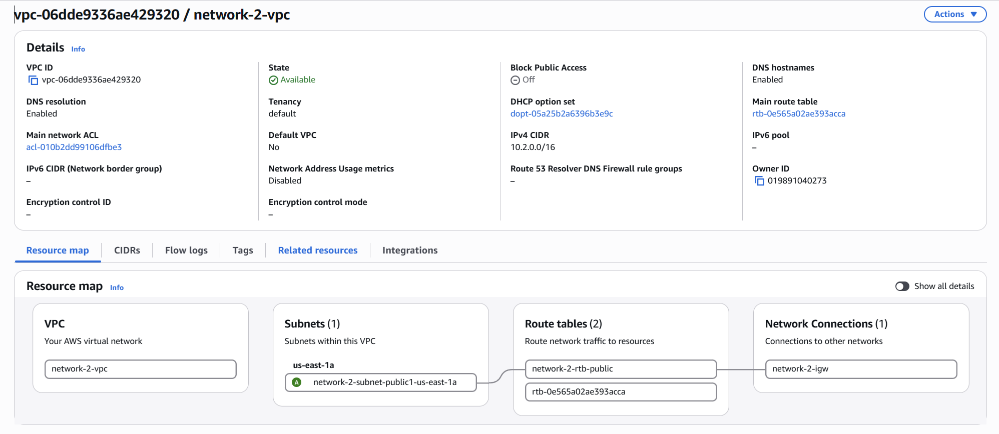

---

### 2. VPC Peering Setup  

To enable private communication between the two VPCs, a VPC peering connection was created. 

The peering process involves one VPC acting as the requester and the other as the accepter. Traffic can only flow between the two VPCs once the request is accepted and routing is configured. 

VPC 1 was selected as the requester and VPC 2 as the accepter.  

The non-overlapping CIDR ranges of both VPCs allow AWS to distinguish the destination networks and route traffic between the VPCs without address conflicts.

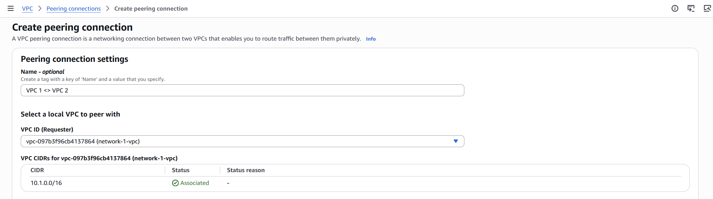  

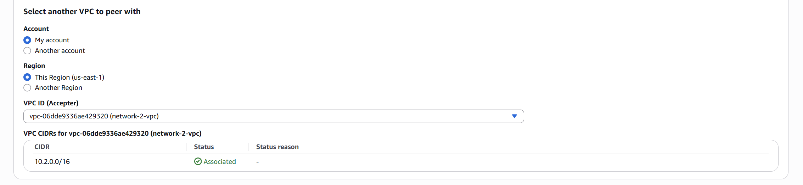  
  
Once created, the peering connection enters a pending state until the accepter approves it.  
  
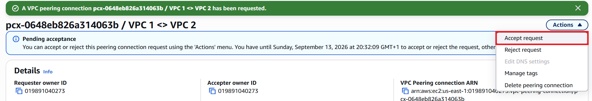
  
The peering request was accepted from the accepter VPC.  
  
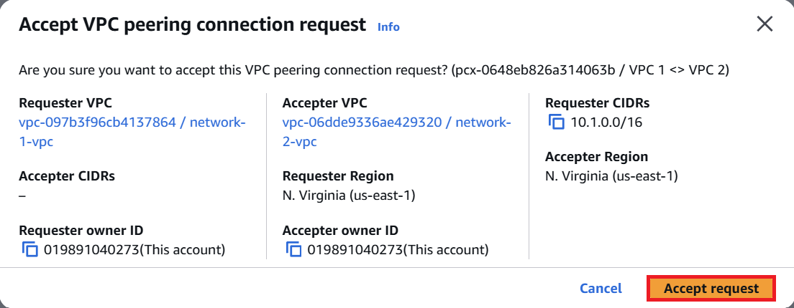

After acceptance, the peering connection becomes active and ready for routing configuration.  
  
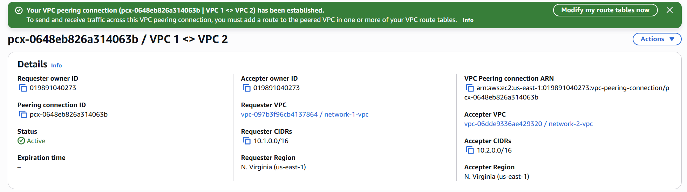  
  
At this point, the two VPCs have an active peering connection, but routes are still required to enable traffic between them.

---

### 3. Route Table Update

The route table in each VPC was updated with a route to the CIDR range of the other VPC, using the VPC peering connection as the target.
  
Even though the peering connection was active, traffic cannot flow between the networks until explicit routes are defined in each VPC’s route table.

A peering route is required in each VPC so that traffic can be routed to the other VPC and return traffic can be routed back through the peering connection.

**VPC 1 Route:**
- Destination: `10.2.0.0/16`  
- Target: VPC Peering  

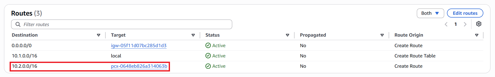  

**VPC 2 Route:**
- Destination: `10.1.0.0/16`  
- Target: VPC Peering  

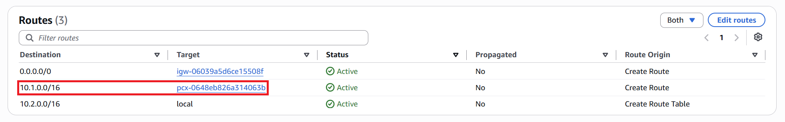

---

### 4. EC2 Instance Deployment  

One EC2 instance was launched in each VPC to act as test endpoints for validating private network connectivity across the peering connection.  
  
Each instance was deployed into a public subnet within its respective VPC. The instances were configured with security groups that allow ICMP traffic from the other VPC and SSH traffic from all networks.

The EC2 instances were also configured with the following:  
  
- **AMI:** Amazon Linux 2023  
- **Instance Type:** t3.micro  

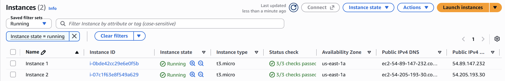

No key pairs were configured for the instances because **EC2 Instance Connect** was used to establish the SSH connections. Each instance was assigned a public IPv4 address, which was used for administrative access through EC2 Instance Connect.

Both EC2 instances were configured with user data to automatically install and start the Apache HTTP server at launch. Each instance also creates a simple web page displaying its role and private IPv4 address. This provides an application-level endpoint for testing connectivity across the peering connection.

The following user data shows the configuration used to automatically install and start Apache on the EC2 instance in VPC 1. The same approach was applied to the second instance.

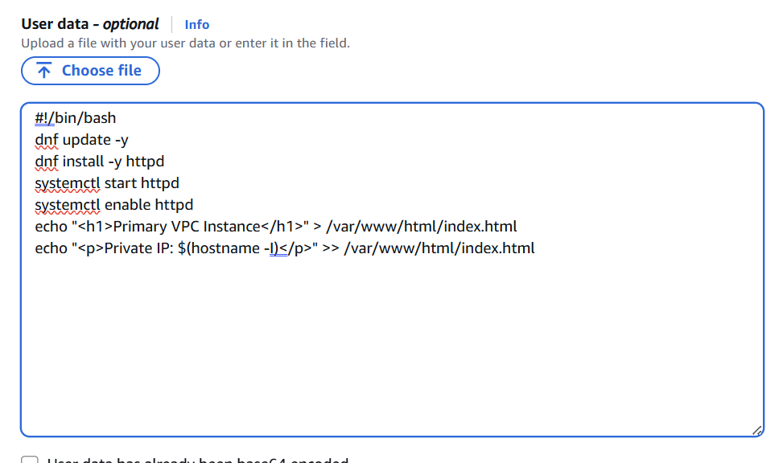

---

### 5. Security Groups and NACLs Check

Before testing connectivity between the EC2 instances, the security groups attached to the EC2 instances and the NACLs associated with their subnets were reviewed to ensure that the required traffic was permitted.

The security groups attached to the EC2 instances were configured to allow:

- **SSH traffic (TCP port 22)** from all networks, allowing EC2 Instance Connect to establish SSH sessions to the instances.
- **ICMP traffic** from the CIDR range of the other VPC, allowing `ping` to verify network-level connectivity across the peering connection.
- **TCP traffic** from the CIDR range of the other VPC, allowing `curl` to reach the Apache web server over HTTP across the peering connection.

Security groups are stateful, which means that return traffic for an allowed connection is permitted automatically.

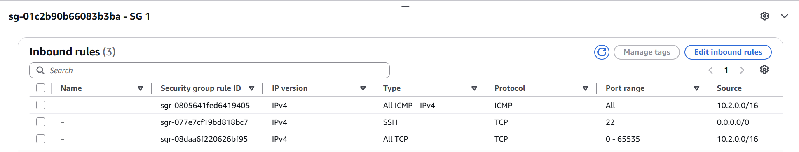

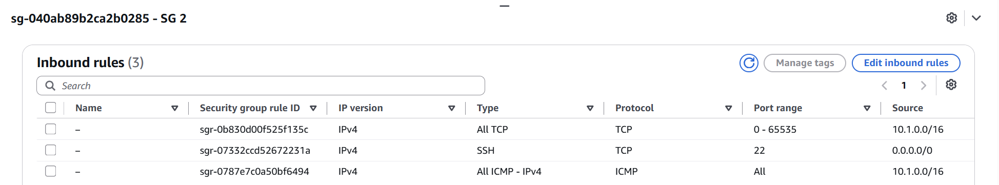

The NACLs associated with the public subnets were also reviewed. Since the default NACL allows inbound and outbound traffic, no additional NACL rules were required for the connectivity test.


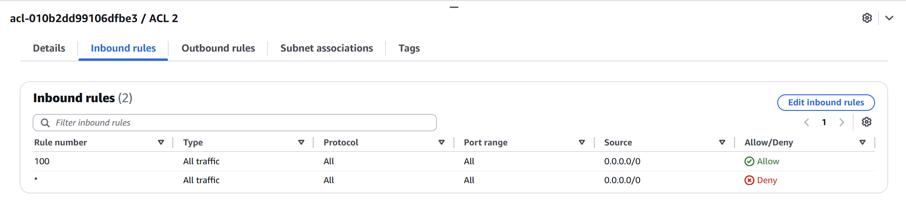

---

### 6. Connectivity Validation  

Once routing and security rules were correctly configured, connectivity between the two VPCs was validated from the EC2 instance in each VPC.  

We connected to the EC2 instances using EC2 Instance Connect. The instances were accessed through their public IPv4 addresses for administrative purposes, while the connectivity tests between the two VPCs were performed using the instances' private IPv4 addresses through the VPC peering connection. This ensured that the inter-VPC traffic being tested remained on the private AWS network rather than traversing the public internet.
 
To verify network connectivity from VPC 1 to VPC 2, the private IPv4 address of the EC2 instance in VPC 2 was tested using ICMP with the `ping` command:

```bash
ping <private-ip>
```

The successful ping responses confirmed that ICMP traffic could traverse the VPC peering connection and reach the EC2 instance in VPC 2.

To further validate connectivity at the application layer, the Apache web server running on the VPC 2 instance was accessed from the VPC 1 instance using the private IPv4 address.

```bash
curl <private-ip>
```

A successful HTTP response from the Apache server confirmed that TCP/HTTP traffic could traverse the VPC peering connection and reach the web server using the destination instance's private IPv4 address.

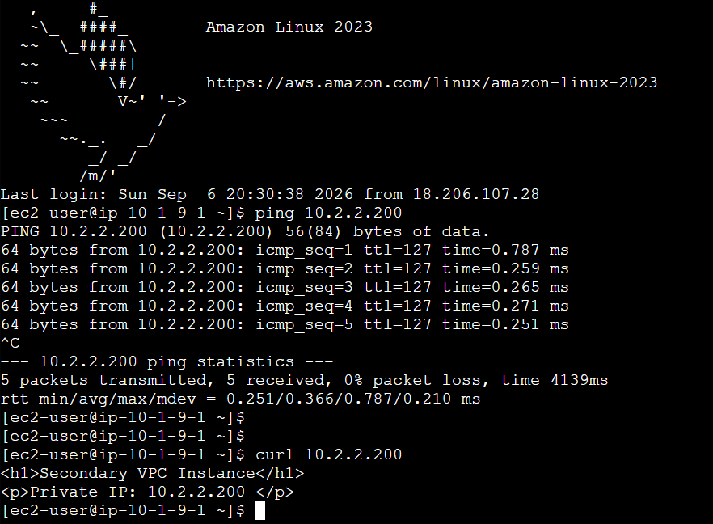

The same tests were then performed from VPC 2 to VPC 1 to verify bidirectional connectivity between the VPCs.

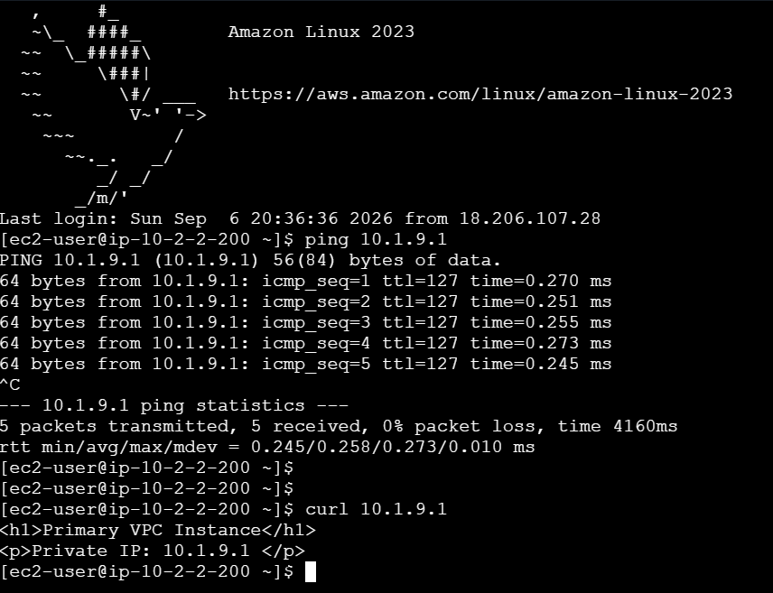

All connectivity tests were performed using the destination instance's **private IPv4 address**, confirming that traffic was routed through the VPC peering connection rather than through the Internet Gateway or public internet.

---

### 7. Infrastructure as Code (Terraform)

After validating the architecture manually in AWS Management Console, the entire environment was recreated using Terraform. This made the deployment repeatable, version-controlled, and easier to provision across environments.

The Terraform configuration provisions:

- Two VPCs with non-overlapping CIDR ranges
- Public subnets in each VPC
- Internet Gateways
- Route tables and route table associations
- VPC peering connection
- Peering routes in both VPCs
- Security groups
- Two EC2 instances with Apache installed via EC2 user data

#### Terraform Structure

```text
terraform/
├── provider.tf
├── variables.tf
├── datasources.tf
├── locals.tf
├── main.tf
├── outputs.tf 
└── .gitignore
```

| File | Purpose |
|---|---|
| `provider.tf` | Configures the AWS provider and region |
| `variables.tf` | Defines reusable inputs such as CIDRs and instance type |
| `datasources.tf` | Retrieves the latest Amazon Linux AMI and Availability Zones |
| `locals.tf` | Stores the EC2 user data scripts for Apache configuration |
| `main.tf` | Creates the networking infrastructure, peering connection, routing, security groups, and EC2 instances |
| `outputs.tf` | Outputs useful resource information such as the EC2 IPv4 addresses |

#### Deployment Workflow

The infrastructure can be deployed with the Terraform workflow:

```bash
terraform init
terraform plan
terraform apply
```

Once testing is complete, the infrastructure can be removed to avoid leaving AWS resources running unnecessarily.

```bash
terraform destroy
```

Terraform provisions the complete VPC peering environment from the configuration files, eliminating the need for manual configuration through the AWS Management Console.

#### Why Terraform?

Implementing the architecture in Terraform provided several advantages:

- Infrastructure is fully reproducible
- Configuration is version-controlled
- Network settings are defined declaratively
- The infrastructure can be deployed consistently across environments with the appropriate AWS provider configuration

---

## Conclusion   
  
This project demonstrated how two separate AWS VPCs can be connected using VPC Peering to enable private communication between resources in isolated networks.

The VPCs were configured with non-overlapping CIDR ranges, public subnets, route tables, Internet Gateways, NACLs, and security groups. A VPC peering connection was established between the two VPCs, and routes were added to each route table to direct traffic destined for the other VPC through the peering connection.

Two EC2 instances were deployed, one in each VPC, and configured with Apache HTTP servers to provide endpoints for connectivity testing. The security groups and NACLs were also reviewed to ensure that the required traffic was permitted.

Connectivity was then validated between the EC2 instances using their private IPv4 addresses. ICMP connectivity was tested using `ping`, while HTTP connectivity was tested using `curl` against the Apache web server running on the remote instance.

The successful tests confirmed that the EC2 instances could communicate across the VPC peering connection using their private IPv4 addresses. This demonstrated that traffic between the two VPCs was routed privately through the peering connection rather than through the public internet.

---
